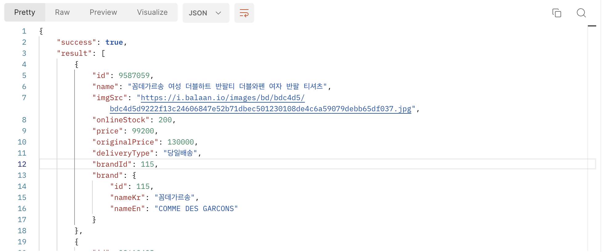
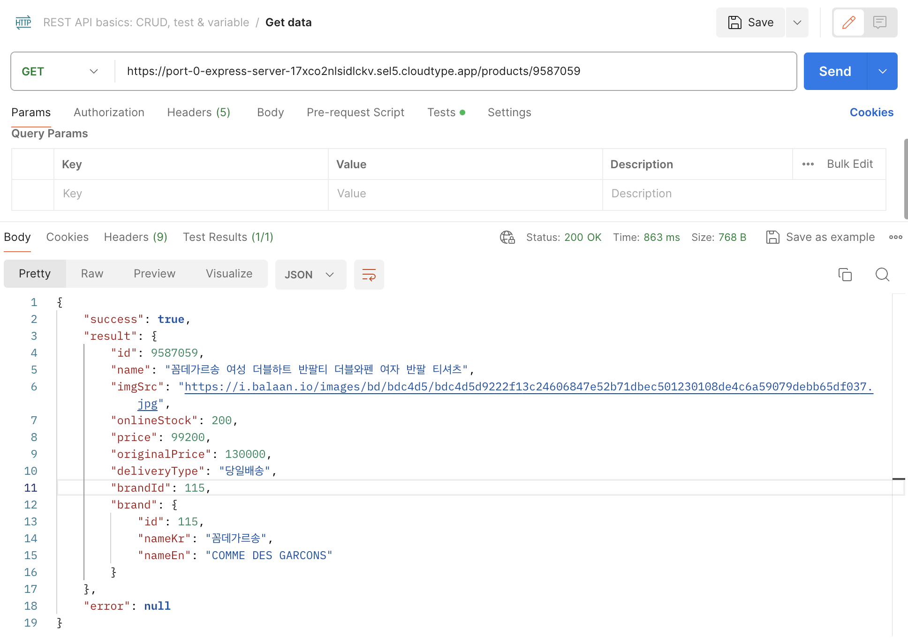
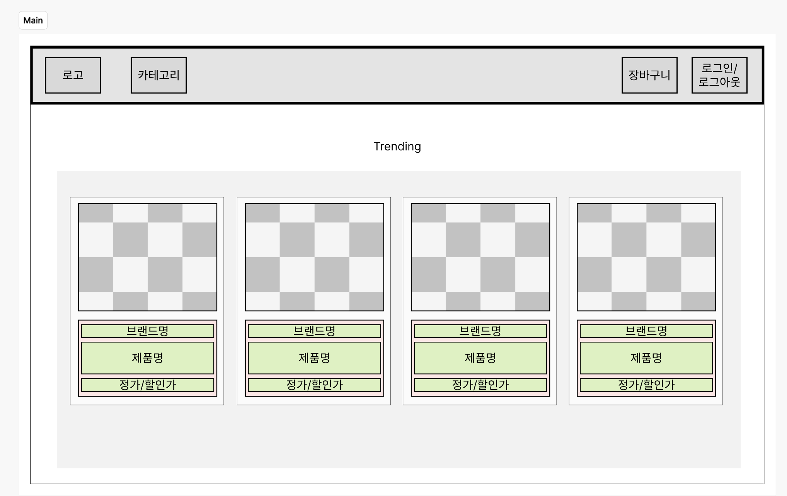

# API

**## API**
**
**
**BaseURL**
https://port-0-express-server-17xco2nlsidlckv.sel5.cloudtype.app

 **axios****를**** ****사용할**** ****때에**** options.withCredentials****에**** true****를**** ****할당하고**** ****사용해**** ****주세요****.** 
**
**
**# Auth**
* **signUp: ****회원가입을**** ****수행합니다****.**

	* path: /auth/sign-up
		* method: POST
		* body(JSON)
			* email: string
				* password: string
				* 

* **logIn: ****로그인을**** ****수행합니다****.**

	* path: /auth/log-in
		* method: POST
		* body(JSON)
			* email: string
				* password: string

* **logOut: ****로그아웃을**** ****수행합니다****.**

	* path: /auth/log-out
		* method: DELETE
* **refreshToken: accessToken****을**** ****리프레시합니다****.**

	* path: /auth/refresh-token
		* method: GET

**# Brands**
* **getBrands: ****전체**** ****브랜드**** ****목록을**** ****제공합니다****.**

	* path: /brands
		* method: GET
* **getBrand: ****특정**** ****브랜드에**** ****대한**** ****정보와**** ****해당**** ****브랜드의**** ****모든**** ****상품**** ****목록을**** ****제공합니다****.**

	* path: /brands/:brandId
		* method: GET

**# Cart**
* **getCart: ****사용자의**** ****장바구니**** ****내용을**** ****제공합니다****.**

	* path: /cart
		* method: GET
* **addItemToCart: ****사용자의**** ****장바구니에**** ****상품을**** ****추가합니다****.**

	* path: /cart/products/:productId
		* method: POST
* **removeItemFromCart: ****사용자의**** ****장바구니에서**** ****상품을**** ****차감합니다****.**

	* path: /cart/products/:productId
		* method: DELETE
* **clearItemInCart: ****사용자의**** ****장바구니에서**** ****상품을**** ****제거합니다****.**

	* path: /cart/products/:productId/clear
		* method: DELETE

**# Products**
* getProducts: 전체 상품 목록을 제공합니다.
	* path: /products
		* method: GET
		* 

* getProduct: 특정 상품의 정보를 제공합니다.
	* path: /products/:productId
		* method: GET
		* 

